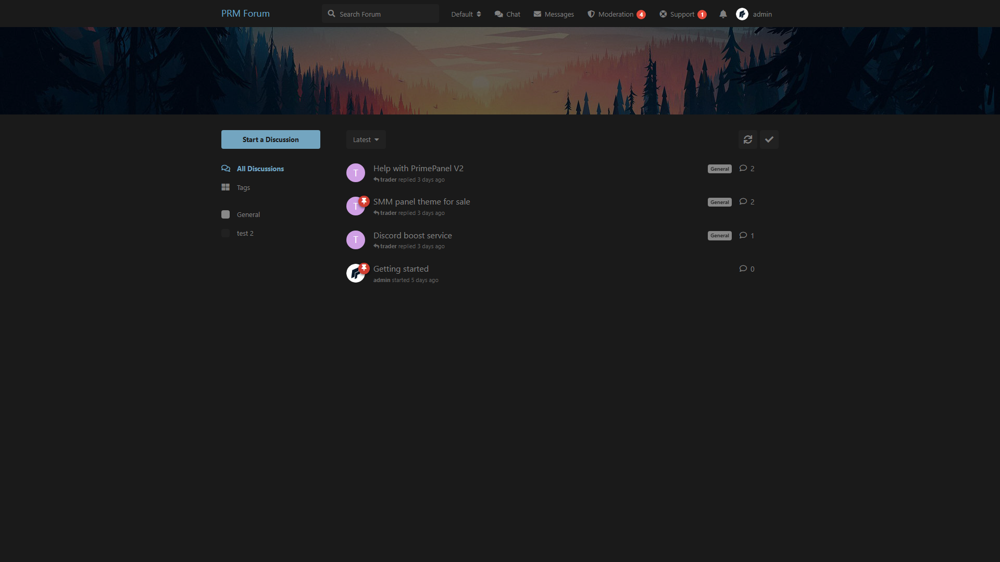
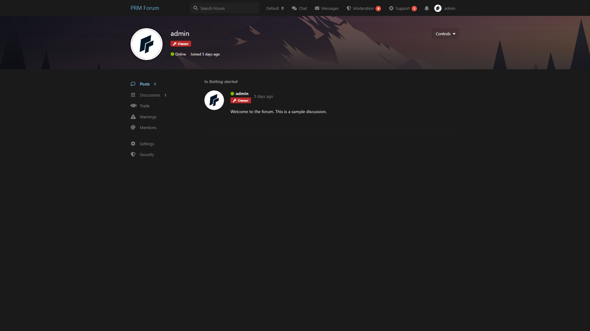
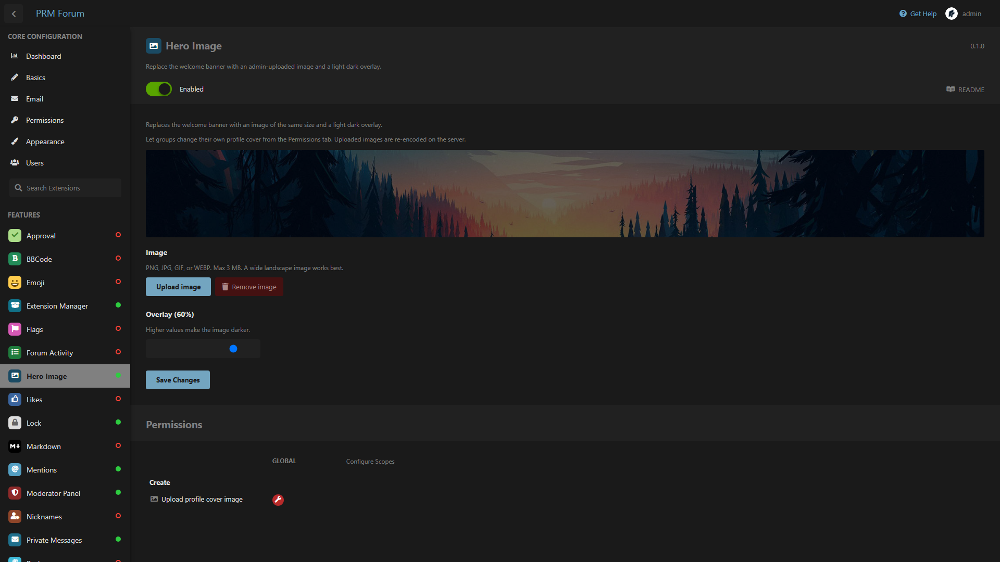

# Hero Image

Replace Flarum’s welcome banner with a homepage image, and let permitted groups upload a cover on their own profile.

Compatible with **Flarum 1.8**.

## Screenshots

Homepage banner:



Profile cover:



Admin settings:



## What it does

- Hides the default “Welcome to Flarum” text banner
- Shows an admin-uploaded image in the same slot, with a dark overlay
- Lets users change **their own profile cover** from **Options → Upload cover image**
- Admins pick which groups may upload a profile cover

## Install

```bash
composer config repositories.prm-hero-image vcs https://github.com/smmpanelscripts1/prm-hero-image
composer require prm/hero-image:dev-main
```

Enable **Hero Image** in the admin extension list, then clear the cache:

```bash
php flarum cache:clear
```

## How to use

### Homepage image

1. Admin → **Hero Image**
2. Upload a wide PNG, JPG, GIF, or WEBP (max 3 MB)
3. Set the overlay strength and save

### Profile cover

1. Admin → Hero Image → **Permissions**
2. Enable **Upload profile cover image** for the groups you want
3. On a profile, open **Options** → **Upload cover image** or **Remove cover image**

Uploads are checked on the server (real MIME type, size, dimensions) and re-encoded to JPEG. SVG/HTML is rejected. Filenames are random.

## License

MIT
